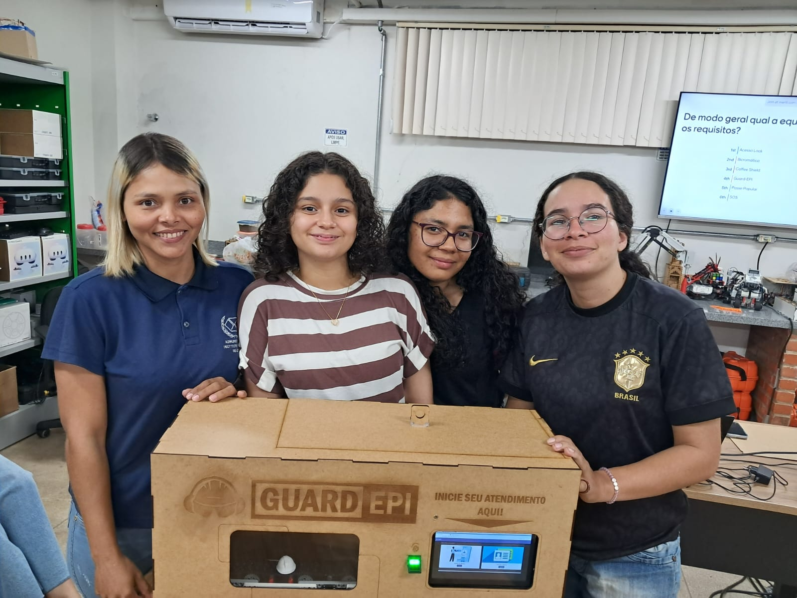
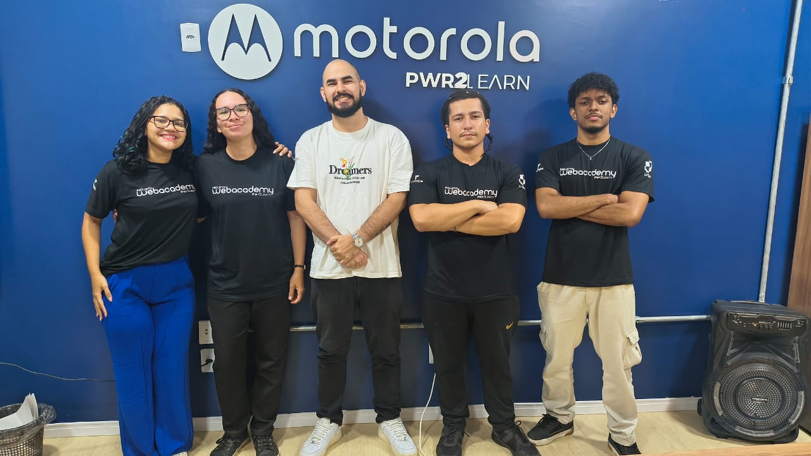

  

### 👩‍💻 Sobre Mim

- 🎓 Formada em Tecnologia em Sistemas para Internet no **IFAC**.
- 🛠️ Focada em **Desenvolvimento Web Full-Stack**, **Desenvolvimento de Jogos** e **Robótica Educacional**.

  

    
    
  

  <picture>
    <source media="(prefers-color-scheme: dark)" srcset="https://raw.githubusercontent.com/Ana-ribeiro-tx/Ana-ribeiro-tx/output/github-contribution-grid-snake-dark.svg">
    <source media="(prefers-color-scheme: light)" srcset="https://raw.githubusercontent.com/Ana-ribeiro-tx/Ana-ribeiro-tx/output/github-contribution-grid-snake.svg">
    
  </picture>

### 🛠️ Minhas Skills

**Front-end:** 

 

**Back-end:** 

 

**Ferramentas & Metodologias:** 

<b>🚀 Capacitação de Destaque </b>(Clique para expandir os detalhes)

#### 🤖 <a href="https://web.ifac.edu.br/incubac/eu-programo-robos/" target="_blank">Eu Programo Robôs - IFAC</a>

_Curso: Tecnologias Disruptivas e Inovação (220h)._

Formação focada na **Indústria 4.0** e prototipagem de hardware:
- **Sistemas Embarcados:** Desenvolvimento de projetos com **Arduino** e **Raspberry Pi**, integrando sensores e atuadores para automação.
- **Fabricação Digital:** Modelagem 2D/3D, técnicas de impressão 3D e corte a laser para prototipagem ágil.
- **IA e Visão:** Aplicação de algoritmos de **Machine Learning** e redes neurais em dispositivos embarcados.
- **Experiência:** Realidade Virtual, Aumentada e Mista aplicada ao design de produtos.

  

  
  
  
  

 

#### 🎓 <a href="https://webacademy.ufac.br/" target="_blank">WebAcademy - UFAC</a>

_Capacitação em Desenvolvimento Web Full-Stack (300h)_

Formação intensiva cobrindo todo o ciclo de vida de uma aplicação:
- **Full-Stack:** Desenvolvimento de aplicações robustas utilizando **Java (Spring Boot)** e **Angular**.
- **DevOps & Cloud:** Implementação de pipelines de **Integração Contínua (CI)** com GitHub Actions e práticas AWS/Google Cloud.
- **Qualidade:** Automação de testes unitários e de integração com JUnit e Selenium.
- **Design:** Aplicação prática de **UX e Design Thinking** para criação de produtos centrados no usuário.

  

  
  
  
  
  
  
  
  
  
  
  
  
  
  
  
  
  

### 📫 Vamos Conversar?

  
  

